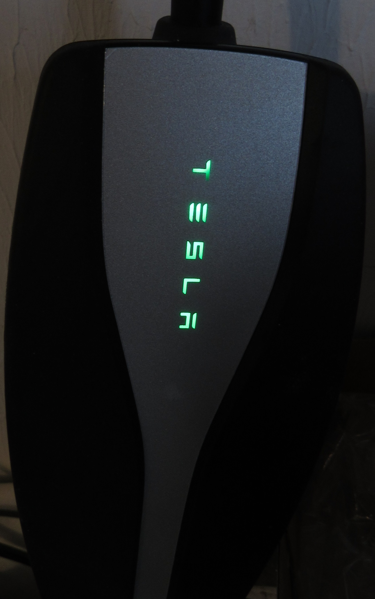

# Model 3 Post Delivery Set Ups and Learnings
Thanks for reading!  Use this [referral](https://ts.la/josephe14597) when ordering your Tesla to receive 1000 free Supercharging miles (available in many states; not available in Ohio).

## Delivery Day
I used this [checklist](https://github.com/mykeln/teslaprep) to review my Model 3 on Delivery Day.  When I arrived home, I was curious about many things.  But, I really wanted to go for another ride so I invited my son to join me and off we went.  I recommend just driving to learn about the control, the regenerative braking, and the acceleration!

That first night, I sat in the driver's seat reading, learning, and experimenting.  This is a list of set ups and learnings.

## Set Up and Learnings
### Floor Mats
I had ordered [floor mats](https://www.taptes.com/products/taptes-3d-all-weather-floor-mats-for-tesla-model-3) for the Model 3.  Before I did anything else, I wanted to install them to protect the original floor.  When I opened the driver's side door, I found specs of dust and dirt from my shoes.  The passenger side was the same.  I vacuumed both sides and the back before installing the floor mats.  **NOTE:** My Model 3 did not have OEM floor mats.

### Wi-Fi
I set up the Model 3 to connect to my wi-fi network.  According to the manual, wi-fi is often faster than cellular networks.  I found it helpful to have the password of my network available.
Touch the cellular icon  at the top right of the screen.  The Model 3 displays a list of networks it found.  Select a network for connection, enter the password, and touch Confirm.  The wifi icon  appears when a connection is established.

### Learn the Menus
From the Touchscreen, there is the Controls menu, the Cards area, an App Launcher, and the Tesla About Box.  In my opinion, learn and use these menus only while in Park.

The Controls menu displays a menu of vehicle control items.  Touch the Model 3 icon  at the lower left to display the Controls menu.  I found it beneficial to learn and experiment with each menu item.  Many of the controls have an "Automated" setting.  The "Automated" setting reduces driver distraction and improves safety.  While I made changes to many items, I returned them to the "Automated" setting.  As I learn more about driving the Model 3, I might make changes. 

The Cards area provide indicators for seat belts, access to the rear view camera, wipers, and other information.  Swipe left to review Trips information; swipe right to review tire pressure.  The tire pressure information showed no indications which may indicate the tires are at their expected pressure.  I have not tried the Trips feature.

The App Launcher displays applications available from the Model 3.  Touch the App Launcher icon ( at lower left and to the right of the Music icon) to display the Apps screen.  I expect these to change over time.  I found the Energy application to be intriguing.  I want to learn more about this so I can improve Model 3 range.  Some of the remaining applications are available through other areas of the Touchscreen.  I do not expect to use the Calendar or the Phone applications.

Lastly, touch the Tesla logo  at the top of the screen to display the Tesla About Box.  In the About Box, there is a link to the Owner's Manual at the lower left.  At the center top of the About Box, swipe down to display Easter Eggs.  While I encourage you to try a few games in the Tesla Arcade, I did not find the steering wheel control very responsive.

### My First Charging Experience
I used the OEM equipment to charge the Model 3 from a 120 volt socket.  I installed the 120 volt adapter into the Mobile Connector (the larger end).  When I plugged the adapter into the 120 volt socket, a reassuring green light appeared behind the word Tesla on the Mobile Connector .

There are three methods of opening the charging port: from the Touchscreen, a double-click on the charging plug (the smaller end of the Mobile Connector), and pressing the lower right edge of the charging port.  Once it was open, I waited for the Tesla logo to turn blue and inserted the charging plug.  The Tesla logo flashed green indicating to the Model 3 was charging.

The next day, I wanted to disconnect the charging plug from the Model 3.  When I pulled on it, it would not come out.  **NOTE:** The charging plug is locked in place.

After I turned on the Model 3, it unlocked the charging plug and I was able to remove it.  Alternatively, press and hold the button on the charging plug to release the lock.

### Locked Car Acknowledgement
After the Model 3 locks, it flashes its lights and toots its horn.  I found that having a horn acknowledgement occur early in the morning could be annoying to sleeping family members or neighbors.  This acknowledgement is configurable.  From the Touchscreen, select Controls -> Locks.  Disable the Lock Confirmation Sound.

### Autopilot
While I was out for a drive, I attempted to engage Autopilot.  I discovered Autopilot is delivered in a disabled state.  That is, Autopilot is installed but could not engage.  I think this is a good thing.  I recommend driving the car a while to get a feel for its behaviors.

You must be in Park to make this change.  From the Touchscreen, select Controls -> Autopilot.  Enable Autosteer (Beta).  I agree and support the warnings and recommendation from Tesla on using this feature.  I strongly recommend reading about the various settings available in Autopilot before using it.  I strongly recommend learning to drive the Model 3 without Autopilot so that you are prepared and confident should something unexpected occur.

### Dashcam and Sentry
I had seen videos from the Sentry mode and wanted to learn more about it.  While reading the manual (it's a habit), I found information on the Dashcam.  Both features record video (no sound) to the same flash drive which installs in one of the USB ports in the forward area of the Center Console (lift the phone dock for easy access).  Only the front USB ports may be used for Dashcam and Sentry.

The flash drive requires a base-level folder named TeslaCam.  When the flash drive is installed in a USB port and the Model 3 is powered on, Dashcam begins recording video.  A small camera icon  appears in the upper left.  A red dot indicates the Model 3 is recording.  The flash drive must be removed to review recorded videos.

To enable Sentry Mode, touch the Sentry icon  near the upper right of the Touchscreen, or navigate from the Touchscreen to Controls -> Safety & Security -> Sentry Mode.  Sentry Mode records video from all cameras when it enters Alert mode.  Sentry Mode may be disabled for places like Home and Work.
